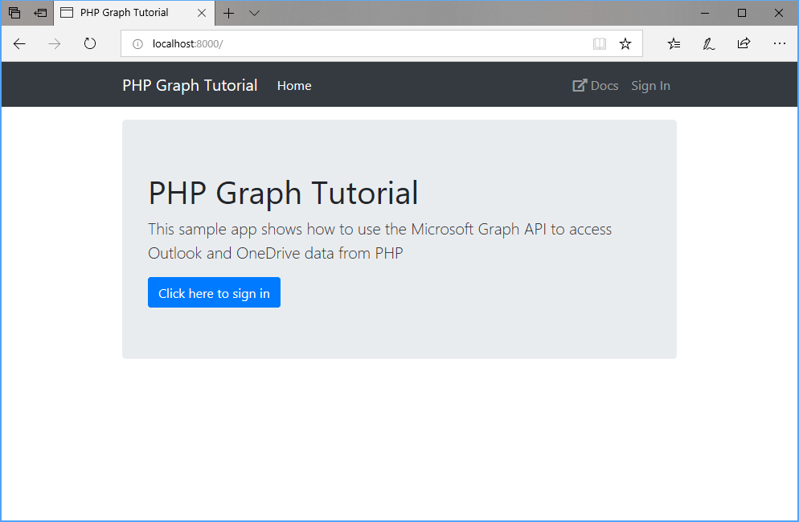

<!-- markdownlint-disable MD002 MD041 -->

Begin by creating a new Laravel project.

1. Open your command-line interface (CLI), navigate to a directory where you have rights to create files, and run the following command to create a new PHP app.

    ```Shell
    laravel new graph-tutorial
    ```

1. Navigate to the **graph-tutorial** directory and enter the following command to start a local web server.

    ```Shell
    php artisan serve
    ```

1. Open your browser and navigate to `http://localhost:8000`. If everything is working, you will see a default Laravel page. If you don't see that page, check the [Laravel docs](https://laravel.com/docs/7.x).

## Install packages

Before moving on, install some additional packages that you will use later:

- [oauth2-client](https://github.com/thephpleague/oauth2-client) for handling sign-in and OAuth token flows.
- [microsoft-graph](https://github.com/microsoftgraph/msgraph-sdk-php) for making calls to Microsoft Graph.

1. Run the following command in your CLI.

    ```Shell
    composer require league/oauth2-client microsoft/microsoft-graph
    ```

## Design the app

1. Create a new file in the **./resources/views** directory named `layout.blade.php` and add the following code.

    :::code language="php" source="../demo/graph-tutorial/resources/views/layout.blade.php" id="LayoutSnippet":::

    This code adds [Bootstrap](http://getbootstrap.com/) for simple styling, and [Font Awesome](https://fontawesome.com/) for some simple icons. It also defines a global layout with a nav bar.

1. Create a new directory in the `./public` directory named `css`, then create a new file in the `./public/css` directory named `app.css`. Add the following code.

    :::code language="css" source="../demo/graph-tutorial/public/css/app.css":::

1. Open the `./resources/views/welcome.blade.php` file and replace its contents with the following.

    :::code language="php" source="../demo/graph-tutorial/resources/views/welcome.blade.php" id="WelcomeSnippet":::

1. Update the base `Controller` class in **./app/Http/Controllers/Controller.php** by adding the following function to the class.

    :::code language="php" source="../demo/graph-tutorial/app/Http/Controllers/Controller.php" id="LoadViewDataSnippet":::

1. Create a new file in the `./app/Http/Controllers` directory named `HomeController.php` and add the following code.

    :::code language="php" source="../demo/graph-tutorial/app/Http/Controllers/HomeController.php":::

1. Update the route in `./routes/web.php` to use the new controller. Replace the entire contents of this file with the following.

    ```php
    <?php

    use Illuminate\Support\Facades\Route;

    Route::get('/', 'HomeController@welcome');
    ```

1. Save all of your changes and restart the server. Now, the app should look very different.

    
