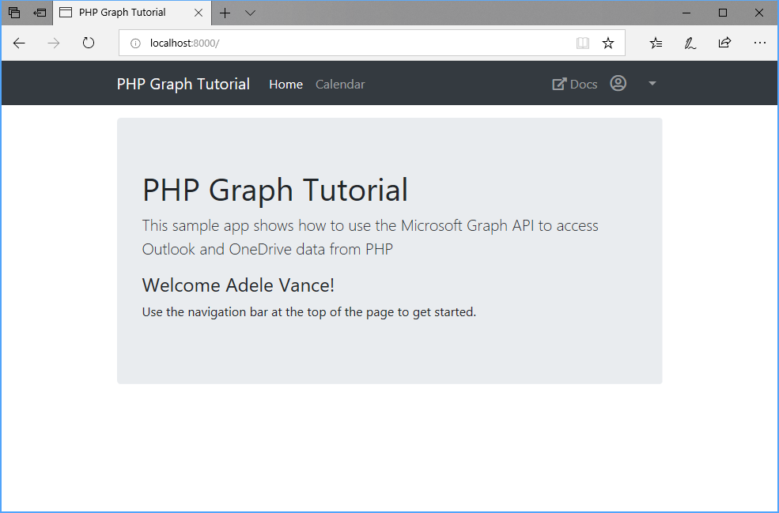

<!-- markdownlint-disable MD002 MD041 -->

In this exercise you will extend the application from the previous exercise to support authentication with Azure AD. This is required to obtain the necessary OAuth access token to call the Microsoft Graph. In this step you will integrate the [oauth2-client](https://github.com/thephpleague/oauth2-client) library into the application.

Open the `.env` file in the root of your PHP application, and add the following code to the end of the file.

```text
OAUTH_APP_ID=YOUR_APP_ID_HERE
OAUTH_APP_PASSWORD=YOUR_APP_PASSWORD_HERE
OAUTH_REDIRECT_URI=http://localhost:8000/callback
OAUTH_SCOPES='openid profile offline_access user.read calendars.read'
OAUTH_AUTHORITY=https://login.microsoftonline.com/common
OAUTH_AUTHORIZE_ENDPOINT=/oauth2/v2.0/authorize
OAUTH_TOKEN_ENDPOINT=/oauth2/v2.0/token
```

Replace `YOUR APP ID HERE` with the application ID from the Application Registration Portal, and replace `YOUR APP SECRET HERE` with the password you generated.

> [!IMPORTANT]
> If you're using source control such as git, now would be a good time to exclude the `.env` file from source control to avoid inadvertently leaking your app ID and password.

## Implement sign-in

Create a new file in the `./app/Http/Controllers` directory named `AuthController.php` and add the following code.

```PHP
<?php

namespace App\Http\Controllers;

use App\Http\Controllers\Controller;
use Illuminate\Http\Request;

class AuthController extends Controller
{
  public function signin()
  {
    // Initialize the OAuth client
    $oauthClient = new \League\OAuth2\Client\Provider\GenericProvider([
      'clientId'                => env('OAUTH_APP_ID'),
      'clientSecret'            => env('OAUTH_APP_PASSWORD'),
      'redirectUri'             => env('OAUTH_REDIRECT_URI'),
      'urlAuthorize'            => env('OAUTH_AUTHORITY').env('OAUTH_AUTHORIZE_ENDPOINT'),
      'urlAccessToken'          => env('OAUTH_AUTHORITY').env('OAUTH_TOKEN_ENDPOINT'),
      'urlResourceOwnerDetails' => '',
      'scopes'                  => env('OAUTH_SCOPES')
    ]);

    $authUrl = $oauthClient->getAuthorizationUrl();

    // Save client state so we can validate in callback
    session(['oauthState' => $oauthClient->getState()]);

    // Redirect to AAD signin page
    return redirect()->away($authUrl);
  }

  public function callback(Request $request)
  {
    // Validate state
    $expectedState = session('oauthState');
    $request->session()->forget('oauthState');
    $providedState = $request->query('state');

    if (!isset($expectedState)) {
      // If there is no expected state in the session,
      // do nothing and redirect to the home page.
      return redirect('/');
    }

    if (!isset($providedState) || $expectedState != $providedState) {
      return redirect('/')
        ->with('error', 'Invalid auth state')
        ->with('errorDetail', 'The provided auth state did not match the expected value');
    }

    // Authorization code should be in the "code" query param
    $authCode = $request->query('code');
    if (isset($authCode)) {
      // Initialize the OAuth client
      $oauthClient = new \League\OAuth2\Client\Provider\GenericProvider([
        'clientId'                => env('OAUTH_APP_ID'),
        'clientSecret'            => env('OAUTH_APP_PASSWORD'),
        'redirectUri'             => env('OAUTH_REDIRECT_URI'),
        'urlAuthorize'            => env('OAUTH_AUTHORITY').env('OAUTH_AUTHORIZE_ENDPOINT'),
        'urlAccessToken'          => env('OAUTH_AUTHORITY').env('OAUTH_TOKEN_ENDPOINT'),
        'urlResourceOwnerDetails' => '',
        'scopes'                  => env('OAUTH_SCOPES')
      ]);

      try {
        // Make the token request
        $accessToken = $oauthClient->getAccessToken('authorization_code', [
          'code' => $authCode
        ]);

        // TEMPORARY FOR TESTING!
        return redirect('/')
          ->with('error', 'Access token received')
          ->with('errorDetail', $accessToken->getToken());
      }
      catch (League\OAuth2\Client\Provider\Exception\IdentityProviderException $e) {
        return redirect('/')
          ->with('error', 'Error requesting access token')
          ->with('errorDetail', $e->getMessage());
      }
    }

    return redirect('/')
      ->with('error', $request->query('error'))
      ->with('errorDetail', $request->query('error_description'));
  }
}
```

This defines a controller with two actions: `signin` and `callback`.

The `signin` action generates the Azure AD signin URL, saves the `state` value generated by the OAuth client, then redirects the browser to the Azure AD signin page.

The `callback` action is where Azure redirects after the signin is complete. That action makes sure the `state` value matches the saved value, then users the authorization code sent by Azure to request an access token. It then redirects back to the home page with the access token in the temporary error value. We'll use this to verify that our sign-in is working before moving on. Before we test, we need to add the routes to `./routes/web.php`.

```PHP
Route::get('/signin', 'AuthController@signin');
Route::get('/callback', 'AuthController@callback');
```

Start the server and browse to `https://localhost:8000`. Click the sign-in button and you should be redirected to `https://login.microsoftonline.com`. Login with your Microsoft account and consent to the requested permissions. The browser redirects to the app, showing the token.

### Get user details

Update the `callback` method in `/app/Http/Controllers/AuthController.php` to get the user's profile from Microsoft Graph.

First, add the following `use` statements to the top of the file, beneath the `namespace App\Http\Controllers;` line.

```php
use Microsoft\Graph\Graph;
use Microsoft\Graph\Model;
```

Replace the `try` block in the `callback` method with the following code.

```php
try {
  // Make the token request
  $accessToken = $oauthClient->getAccessToken('authorization_code', [
    'code' => $authCode
  ]);

  $graph = new Graph();
  $graph->setAccessToken($accessToken->getToken());

  $user = $graph->createRequest('GET', '/me')
    ->setReturnType(Model\User::class)
    ->execute();

  // TEMPORARY FOR TESTING!
  return redirect('/')
    ->with('error', 'Access token received')
    ->with('errorDetail', 'User:'.$user->getDisplayName().', Token:'.$accessToken->getToken());
}
```

The new code creates a `Graph` object, assigns the access token, then uses it to request the user's profile. It adds the user's display name to the temporary output for testing.

## Storing the tokens

Now that you can get tokens, it's time to implement a way to store them in the app. Since this is a sample app, for simplicity's sake, you'll store them in the session. A real-world app would use a more reliable secure storage solution, like a database.

Create a new directory in the `./app` directory named `TokenStore`, then create a new file in that directory named `TokenCache.php`, and add the following code.

```php
<?php

namespace App\TokenStore;

class TokenCache {
  public function storeTokens($accessToken, $user) {
    session([
      'accessToken' => $accessToken->getToken(),
      'refreshToken' => $accessToken->getRefreshToken(),
      'tokenExpires' => $accessToken->getExpires(),
      'userName' => $user->getDisplayName(),
      'userEmail' => null !== $user->getMail() ? $user->getMail() : $user->getUserPrincipalName()
    ]);
  }

  public function clearTokens() {
    session()->forget('accessToken');
    session()->forget('refreshToken');
    session()->forget('tokenExpires');
    session()->forget('userName');
    session()->forget('userEmail');
  }

  public function getAccessToken() {
    // Check if tokens exist
    if (empty(session('accessToken')) ||
        empty(session('refreshToken')) ||
        empty(session('tokenExpires'))) {
      return '';
    }

    return session('accessToken');
  }
}
```

Then, update the `callback` function in the `AuthController` class to store the tokens in the session and redirect back to the main page.

First, add the following `use` statement to the top of `./app/Http/Controllers/AuthController.php`, beneath the `namespace App\Http\Controllers;` line.

```php
use App\TokenStore\TokenCache;
```

Then replace the `try` block in the existing `callback` function with the following.

```php
try {
  // Make the token request
  $accessToken = $oauthClient->getAccessToken('authorization_code', [
    'code' => $authCode
  ]);

  $graph = new Graph();
  $graph->setAccessToken($accessToken->getToken());

  $user = $graph->createRequest('GET', '/me')
    ->setReturnType(Model\User::class)
    ->execute();

  $tokenCache = new TokenCache();
  $tokenCache->storeTokens($accessToken, $user);

  return redirect('/');
}
```

## Implement sign-out

Before you test this new feature, add a way to sign out. Add the following action to the `AuthController` class.

```PHP
public function signout()
{
  $tokenCache = new TokenCache();
  $tokenCache->clearTokens();
  return redirect('/');
}
```

Add this action to `./routes/web.php`.

```PHP
Route::get('/signout', 'AuthController@signout');
```

Restart the server and go through the sign-in process. You should end up back on the home page, but the UI should change to indicate that you are signed-in.



Click the user avatar in the top right corner to access the **Sign Out** link. Clicking **Sign Out** resets the session and returns you to the home page.


## Refreshing tokens

At this point your application has an access token, which is sent in the `Authorization` header of API calls. This is the token that allows the app to access the Microsoft Graph on the user's behalf.

However, this token is short-lived. The token expires an hour after it is issued. This is where the refresh token becomes useful. The refresh token allows the app to request a new access token without requiring the user to sign in again. Update the token management code to implement token refresh.

Open `./app/TokenStore/TokenCache.php` and add the following function to the `TokenCache` class.

```php
public function updateTokens($accessToken) {
  session([
    'accessToken' => $accessToken->getToken(),
    'refreshToken' => $accessToken->getRefreshToken(),
    'tokenExpires' => $accessToken->getExpires()
  ]);
}
```

Then replace the existing `getAccessToken` function with the following.

```php
public function getAccessToken() {
  // Check if tokens exist
  if (empty(session('accessToken')) ||
      empty(session('refreshToken')) ||
      empty(session('tokenExpires'))) {
    return '';
  }

  // Check if token is expired
  //Get current time + 5 minutes (to allow for time differences)
  $now = time() + 300;
  if (session('tokenExpires') <= $now) {
    // Token is expired (or very close to it)
    // so let's refresh

    // Initialize the OAuth client
    $oauthClient = new \League\OAuth2\Client\Provider\GenericProvider([
      'clientId'                => env('OAUTH_APP_ID'),
      'clientSecret'            => env('OAUTH_APP_PASSWORD'),
      'redirectUri'             => env('OAUTH_REDIRECT_URI'),
      'urlAuthorize'            => env('OAUTH_AUTHORITY').env('OAUTH_AUTHORIZE_ENDPOINT'),
      'urlAccessToken'          => env('OAUTH_AUTHORITY').env('OAUTH_TOKEN_ENDPOINT'),
      'urlResourceOwnerDetails' => '',
      'scopes'                  => env('OAUTH_SCOPES')
    ]);

    try {
      $newToken = $oauthClient->getAccessToken('refresh_token', [
        'refresh_token' => session('refreshToken')
      ]);

      // Store the new values
      $this->updateTokens($newToken);

      return $newToken->getToken();
    }
    catch (League\OAuth2\Client\Provider\Exception\IdentityProviderException $e) {
      return '';
    }
  }

  // Token is still valid, just return it
  return session('accessToken');
}
```

This method first checks if the access token is expired or close to expiring. If it is, then it uses the refresh token to get new tokens, then updates the cache and returns the new access token.
