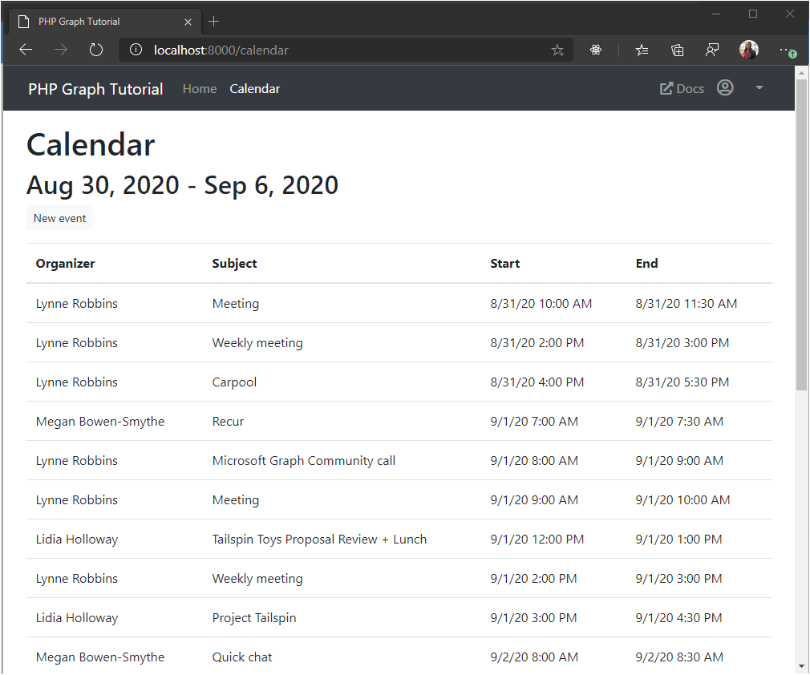

<!-- markdownlint-disable MD002 MD041 -->

In this exercise you will incorporate the Microsoft Graph into the application. For this application, you will use the [microsoft-graph](https://github.com/microsoftgraph/msgraph-sdk-php) library to make calls to Microsoft Graph.

## Get calendar events from Outlook

1. Create a new directory in the **./app** directory named `TimeZones`, then create a new file in that directory named `TimeZones.php`, and add the following code.

    :::code language="php" source="../demo/graph-tutorial/app/TimeZones/TimeZones.php":::

    This class implements a simplistic mapping of Windows time zone names to IANA time zone identifiers.

1. Create a new file in the **./app/Http/Controllers** directory named `CalendarController.php`, and add the following code.

    ```php
    <?php

    namespace App\Http\Controllers;

    use App\Http\Controllers\Controller;
    use Illuminate\Http\Request;
    use Microsoft\Graph\Graph;
    use Microsoft\Graph\Model;
    use App\TokenStore\TokenCache;
    use App\TimeZones\TimeZones;

    class CalendarController extends Controller
    {
      public function calendar()
      {
        $viewData = $this->loadViewData();

        $graph = $this->getGraph();

        // Get user's timezone
        $timezone = TimeZones::getTzFromWindows($viewData['userTimeZone']);

        // Get start and end of week
        $startOfWeek = new \DateTimeImmutable('sunday -1 week', $timezone);
        $endOfWeek = new \DateTimeImmutable('sunday', $timezone);

        $viewData['dateRange'] = $startOfWeek->format('M j, Y').' - '.$endOfWeek->format('M j, Y');

        $queryParams = array(
          'startDateTime' => $startOfWeek->format(\DateTimeInterface::ISO8601),
          'endDateTime' => $endOfWeek->format(\DateTimeInterface::ISO8601),
          // Only request the properties used by the app
          '$select' => 'subject,organizer,start,end',
          // Sort them by start time
          '$orderby' => 'start/dateTime',
          // Limit results to 25
          '$top' => 25
        );

        // Append query parameters to the '/me/calendarView' url
        $getEventsUrl = '/me/calendarView?'.http_build_query($queryParams);

        $events = $graph->createRequest('GET', $getEventsUrl)
          // Add the user's timezone to the Prefer header
          ->addHeaders(array(
            'Prefer' => 'outlook.timezone="'.$viewData['userTimeZone'].'"'
          ))
          ->setReturnType(Model\Event::class)
          ->execute();

        return response()->json($events);
      }

      private function getGraph(): Graph
      {
        // Get the access token from the cache
        $tokenCache = new TokenCache();
        $accessToken = $tokenCache->getAccessToken();

        // Create a Graph client
        $graph = new Graph();
        $graph->setAccessToken($accessToken);
        return $graph;
      }
    }
    ```

    Consider what this code is doing.

    - The URL that will be called is `/v1.0/me/calendarView`.
    - The `startDateTime` and `endDateTime` parameters define the start and end of the view.
    - The `$select` parameter limits the fields returned for each events to just those the view will actually use.
    - The `$orderby` parameter sorts the results by the date and time they were created, with the most recent item being first.
    - The `$top` parameter limits the results to 25 events.
    - The `Prefer: outlook.timezone=""` header causes the start and end times in the response to be adjusted to the user's preferred time zone.

1. Update the routes in **./routes/web.php** to add a route to this new controller.

    ```php
    Route::get('/calendar', 'CalendarController@calendar');
    ```

1. Sign in and click the **Calendar** link in the nav bar. If everything works, you should see a JSON dump of events on the user's calendar.

## Display the results

Now you can add a view to display the results in a more user-friendly manner.

1. Create a new file in the **./resources/views** directory named `calendar.blade.php` and add the following code.

    :::code language="php" source="../demo/graph-tutorial/resources/views/calendar.blade.php" id="CalendarSnippet":::

    That will loop through a collection of events and add a table row for each one.

1. Update the routes in **./routes/web.php** to add routes for `/calendar/new`. You will implement these functions in the next section, but the route need to be defined now because **calendar.blade.php** references it.

    ```php
    Route::get('/calendar/new', 'CalendarController@getNewEventForm');
    Route::post('/calendar/new', 'CalendarController@createNewEvent');
    ```

1. Remove the `return response()->json($events);` line from the `calendar` action in **./app/Http/Controllers/CalendarController.php**, and replace it with the following code.

    ```php
    $viewData['events'] = $events;
    return view('calendar', $viewData);
    ```

1. Refresh the page and the app should now render a table of events.

    
