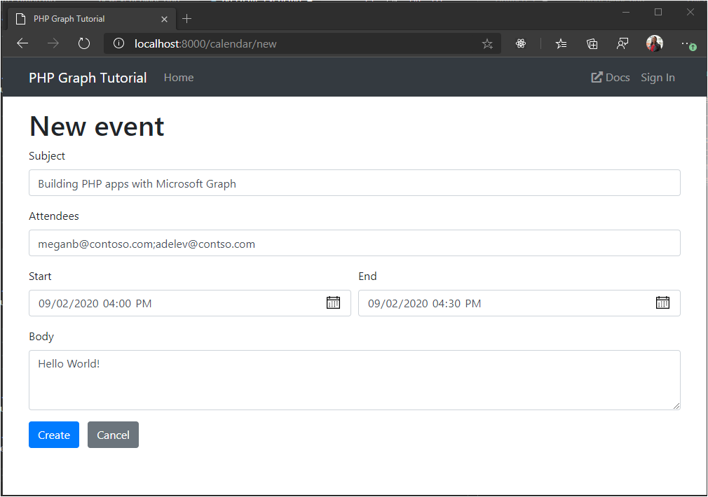

<!-- markdownlint-disable MD002 MD041 -->

In this section you will add the ability to create events on the user's calendar.

## Create new event form

1. Create a new file in the **./resources/views** directory named `newevent.blade.php` and add the following code.

    :::code language="php" source="../demo/graph-tutorial/resources/views/newevent.blade.php" id="NewEventFormSnippet":::

## Add controller actions

1. Open **./app/Http/Controllers/CalendarController.php** and add the following function to render the form.

    :::code language="php" source="../demo/graph-tutorial/app/Http/Controllers/CalendarController.php" id="getNewEventFormSnippet":::

1. Add the following function to receive the form data when the user's submits, and create a new event on the user's calendar.

    :::code language="php" source="../demo/graph-tutorial/app/Http/Controllers/CalendarController.php" id="createNewEventSnippet":::

    Consider what this code does.

    - It converts the attendees field input to an array of Graph [attendee](https://docs.microsoft.com/graph/api/resources/attendee?view=graph-rest-1.0) objects.
    - It builds an [event](https://docs.microsoft.com/graph/api/resources/event?view=graph-rest-1.0) from the form input.
    - It sends a POST to the `/me/events` endpoint, then redirects back to the calendar view.

1. Update the routes in **./routes/web.php** to add routes for these new functions on the controller.

    ```php
    Route::get('/calendar/new', 'CalendarController@getNewEventForm');
    Route::post('/calendar/new', 'CalendarController@createNewEvent');
    ```

1. Save all of your changes and restart the server. Use the **New event** button to navigate to the new event form.

1. Fill in the values on the form. Use a start date from the current week. Select **Create**.

    

1. When the app redirects to the calendar view, verify that your new event is present in the results.
